# CopperBench Presentation Outline

## Slide 1: Title

**CopperBench: Evaluating LLM Copper Estimation for Recipes**

- Task: predict recipe-level copper content in mg per serving.
- Focus: how model choice, recipe information, prompting, and failure-mode mitigation affect micronutrient estimates.
- Dataset: 26 recipes from `recipes.json`, with reference `copper_per_serving_mg`.

---

## Slide 2: Problem Definition

**Problem:** Given a recipe, estimate `copper_mg_per_serving`.

**Example input**

```text
Recipe Name: Cranberry Carrot Muffins
Ingredients: 1/2 cup dried cranberries; 1 cup all-purpose flour; 1 egg;
medium carrot; apple; oil; milk; sugars; vanilla; cinnamon; salt
Servings: 6 muffins
```

**Example model output**

```json
{
  "dish_name": "Cranberry Carrot Muffins",
  "servings": 6,
  "total_copper_mg": 0.26,
  "copper_mg_per_serving": 0.04
}
```

Reference label for this recipe: `0.06 mg/serving`.

Evaluation compares the predicted `copper_mg_per_serving` against the reference label.

---

## Slide 3: Motivation

**Typical approach**

- Nutrient estimation is usually solved by mapping each ingredient to a food-composition database entry, converting quantities to grams, summing nutrient contributions, and dividing by servings.
- USDA FoodData Central is the expected source for food-level nutrient values.
- This requires ingredient normalization, quantity parsing, unit conversion, density assumptions, and handling optional or negligible ingredients.

**What is missing or unknown**

- Whether LLMs can perform this full pipeline reliably from recipe text.
- Whether more capable models or higher reasoning effort actually improve micronutrient estimation.
- Whether LLM estimates fail because of missing quantities, bad ingredient copper values, unit conversion errors, or systematic overestimation.
- Whether prompt engineering can mitigate the main failure modes.

---

## Slide 4: Main Ideas Investigated

1. **Model benchmarking with full recipe information**
   - Compare GPT model families and reasoning levels when ingredient proportions are present.

2. **Information ablation**
   - Remove ingredient proportions and test how much performance depends on explicit quantities.

3. **Prompt interventions**
   - Compare baseline, persona, few-shot, chain-of-thought, and combined persona + few-shot prompts.

4. **Failure-mode clustering**
   - Cluster high-error reasoning summaries to identify recurring reasoning patterns.

5. **Targeted mitigation**
   - Use failure-mode insights to build prompts that emphasize database lookup, food-specific density conversion, optional-ingredient exclusion, and conservative handling of trace contributors.

---

## Slide 5: Project Stages

The repository is organized around three main experimental stages, plus two intermediate analysis stages.

| Stage | Folder | Question answered | Recipe information | Main output |
|---|---|---|---|---|
| Stage 1 | `stage1_recipe_proportions/` | Which model performs best when full ingredient amounts are available? | Recipe name, ingredients, proportions, servings | Model benchmark and baseline errors |
| Stage 1.5 | `stage1.5_clustering_analysis/` | Why do high-error predictions fail? | Stage 1 outputs and reasoning summaries | Failure-mode clusters |
| Stage 2 | `stage2_recipe_no_proportions/` | What happens when ingredient amounts are removed? | Recipe name, ingredient names only, servings | No-proportions baseline and prompt variants |
| Stage 2.5 | `stage2.5_combined_prompts/` | Do combined prompt strategies help without proportions? | No-proportions recipes | 3-run averaged prompt comparison |
| Stage 3 | `stage3_recipe_proportions/` | Can failure-mode-informed prompts improve estimates when proportions are available? | Full recipes with proportions | Targeted mitigation results |

**Simplified narrative for the presentation:** Stage 1 benchmarks models, Stage 2 tests the harder no-quantity setting, and Stage 3 uses failure analysis to improve prompting.

---

## Slide 6: Method Details

```mermaid
flowchart LR
    A[recipes.json<br/>26 labeled recipes<br/>with ingredient proportions]
    A --> B[Stage 1<br/>full recipe proportions]
    B --> C[Compare model families<br/>and reasoning levels]
    C --> D[Select strongest baseline<br/>gpt-5.4-mini]
    D --> E[CoT / reasoning-summary analysis]
    E --> F[Identify failure modes<br/>overestimation, bad ingredient values,<br/>weight and density mistakes]
    F --> G[Design mitigations<br/>persona protocol, few-shot examples,<br/>conservative trace handling]
    G --> H[Stage 2<br/>no ingredient proportions]
    H --> I[Test mitigated prompts<br/>under missing-quantity setting]
    I --> J[Stage 3<br/>recipes with proportions again]
    J --> K[Replicate evaluation<br/>measure whether mitigations improve MAE<br/>and reduce bias]
```



**Core evaluator behavior**

- Flattens `recipes.json` into recipe records.
- Discovers model JSONL output files.
- Extracts `parsed_output.copper_mg_per_serving`.
- Keeps the latest trial per recipe/model.
- Excludes malformed predictions from metric calculations.

---

## Slide 7: Evaluation Setup

**Dataset statistics**

| Recipe type | Count | Avg. ingredients | Copper range mg/serving | Avg. copper |
|---|---:|---:|---:|---:|
| anytime_meals | 11 | 14.2 | 0.04-0.19 | 0.112 |
| breakfast | 5 | 10.6 | 0.06-0.17 | 0.126 |
| desserts | 5 | 10.2 | 0.02-0.10 | 0.048 |
| snacks | 5 | 2.8 | 0.10-0.23 | 0.154 |
| **Total** | **26** | **10.5** | **0.02-0.23** | **0.110** |

**Systems compared**

- Stage 1: 18 model output files across GPT-4.1, GPT-4o, GPT-5.4, GPT-5.4-mini, GPT-5.4-nano, GPT-5.4-pro, and GPT-5.5 variants.
- Stage 2 / 2.5: `gpt-5.4-mini` medium reasoning with baseline, persona, few-shot, CoT, and combined persona + few-shot prompts.
- Stage 3: targeted persona and combined persona + few-shot prompts with proportions, evaluated over 3 replicate runs.

**Metrics**

- Mean absolute error (MAE), in mg per serving.
- MSE/RMSE where available.
- Accuracy within relative tolerance: Stage 1 uses +/-10%; Stage 2/3 primarily use +/-20%, with Stage 3 also reporting +/-10%.
- Valid prediction count and per-recipe error analysis.

---

## Slide 8: Key Results - Stage 1 Model Benchmark

**Full recipe information with proportions**

| Rank | Model | Reasoning | MAE | Accuracy within +/-10% | Valid |
|---:|---|---|---:|---:|---:|
| 1 | `gpt_5_4_mini` | low | 0.0496 | 15.38% | 26/26 |
| 2 | `gpt_5_4_mini` | medium | 0.0550 | 26.92% | 26/26 |
| 3 | `gpt_5_4_pro` | high | 0.0593 | 19.23% | 26/26 |

**Takeaways**

- `gpt-5.4-mini` was strongest overall in this benchmark.
- Higher reasoning effort did not monotonically improve MAE.
- Even the best model had low strict relative accuracy because the true copper values are small; a 0.02 mg miss can be a large percentage error.

---

## Slide 9: Key Results - Prompting and Information Ablation

**No ingredient proportions, 3-run average, +/-20% accuracy**

| Rank | Prompt | MAE | Mean signed error | Accuracy |
|---:|---|---:|---:|---:|
| 1 | Combined persona + few-shot | 0.0880 | +0.0709 | 20.51% |
| 2 | Persona | 0.0940 | +0.0724 | 28.21% |
| 3 | Baseline | 0.1023 | +0.0933 | 21.79% |
| 4 | Few-shot | 0.1143 | +0.1009 | 14.10% |
| 5 | CoT | 0.1197 | +0.1107 | 23.08% |

**Takeaways**

- Removing proportions substantially worsened estimates.
- All Stage 2 variants overestimated on average.
- Persona prompting helped, but few-shot and CoT alone did not reliably improve the baseline.

---

## Slide 10: Key Results - Targeted Mitigation

**With proportions, 3-run average, Stage 3**

| Prompt | Avg. MAE | Avg. MSE | Accuracy within +/-20% | Accuracy within +/-10% |
|---|---:|---:|---:|---:|
| Combined persona + few-shot | 0.0452 | 0.00536 | 47.44% | 20.51% |
| Persona | 0.0461 | 0.00575 | 44.87% | 24.36% |
| Stage 1 baseline, `gpt_5_4_mini` medium | 0.0550 | n/a | 42.31% | 26.92% |

**Takeaways**

- Targeted prompts improved MAE compared with the Stage 1 medium-reasoning baseline.
- Combined persona + few-shot achieved the best MAE and best +/-20% accuracy.
- Persona alone was very close, suggesting that most gains came from explicit estimation protocol and bias controls.

---

## Slide 11: Analysis - Failure Modes

**Failure-mode clustering on high-error predictions**

| Cluster | Size | Label | Avg. MAE | Direction | Main issue |
|---:|---:|---|---:|---|---|
| -1 | 50 | Systematic ingredient copper overestimation | 0.200 | over | Many small ingredients assigned inflated copper and summed |
| 0 | 22 | Incorrect copper values for snack ingredients | 0.145 | mixed | Snack ingredients such as seeds, pretzels, toppings handled inconsistently |
| 2 | 12 | Systematic copper overestimation via weight-based method | 0.942 | over | Weight-based estimation without database validation inflated totals |

**Mitigation evidence**

| Failure mode | Baseline MAE | Persona MAE | Combined MAE |
|---|---:|---:|---:|
| Systematic ingredient overestimation | 0.0942 | 0.0715 | 0.0703 |
| Snack ingredient value errors | 0.0392 | 0.0471 | 0.0490 |
| Weight-based overestimation | 0.1047 | 0.0743 | 0.0718 |

**Interpretation**

- The targeted prompt reduced the two overestimation-heavy clusters.
- It did not improve the snack cluster, likely because the issue is ingredient-specific reference value uncertainty rather than general calculation protocol.

---

## Slide 12: Analysis - Example Wins and Failures

**Works well**

| Recipe | Type | True | Prediction / avg. error | Why it likely works |
|---|---|---:|---:|---|
| Crispy Rice Cereal Treats | dessert | 0.02 | Stage 3 avg. error 0.0045 | Simple low-copper recipe with few meaningful contributors |
| Carob Cupcakes with Cream Cheese Frosting | dessert | 0.03 | Stage 3 avg. error 0.0055 | Low copper and ingredient contributions are mostly negligible |
| Cheesy Egg, Bacon & Broccoli Muffins | breakfast | 0.08 | Stage 3 avg. error 0.0063 | Familiar ingredients and moderate serving normalization |

**Fails**

| Recipe | Type | True | Stage 3 avg. error | Failure pattern |
|---|---|---:|---:|---|
| One-Pot Beef & Mushroom Lasagna | anytime meal | 0.09 | 0.2462 | Overestimation from complex multi-ingredient dish |
| Chicken Sausage Garden Pasta | anytime meal | 0.04 | 0.1631 | Very low ground truth makes overestimation severe |
| Avocado Toast with Feta | snack | 0.23 | 0.1529 | Snack/topping ingredient values remain hard to calibrate |

---

## Slide 13: Conclusions

**What we learned**

- LLMs can produce structured copper-per-serving estimates, but exact micronutrient estimation remains difficult.
- Ingredient proportions matter: removing them increases MAE and produces consistent overestimation.
- Bigger models and higher reasoning effort are not automatically better.
- Error analysis is useful: the main failures are systematic overestimation, bad ingredient copper references, and weight/density mistakes.
- Targeted prompts based on failure modes improved MAE and +/-20% accuracy, especially for overestimation-heavy clusters.

**Future work**

- Expand beyond 26 recipes and include more high-copper recipes; the current dataset is concentrated between 0.02 and 0.23 mg/serving.
- Add a retrieval or tool-use baseline that directly queries USDA FoodData Central.
- Evaluate ingredient-level decompositions, not only final copper totals.
- Add calibration methods to correct systematic overestimation.
- Separate optional ingredient handling, density conversion, and database lookup into individually testable subtasks.

---

## Slide 14: Suggested Visuals to Include

- Project-level stage progression: `presentation_artifacts/stage_progression_mae.png`
- Project-level prediction calibration: `presentation_artifacts/prediction_vs_ground_truth_by_stage.png`
- Key-results summary: `presentation_artifacts/key_results_summary.png`
- Project-level summary table: `presentation_artifacts/stage_progression_summary.md`
- Stage 1 MAE chart: `stage1_recipe_proportions/evaluation_results/mae_comparison.png`
- Stage 1 reasoning plot: `stage1_recipe_proportions/evaluation_results/reasoning_effort_effect.png`
- Failure cluster sizes: `stage1.5_clustering_analysis/visualizations/cluster_sizes.png`
- Failure mode heatmap: `stage1.5_clustering_analysis/visualizations/failure_mode_recipe_type_heatmap.png`
- Stage 2.5 prompt comparison: `stage2.5_combined_prompts/replicate_runs/averaged_evaluation_results/average_mae_comparison.png`
- Stage 3 mitigation chart: `stage3_recipe_proportions/replicate_runs/stage3_cluster_mitigation_mae_by_cluster.png`

---

## Source Artifacts Used

- `recipes.json`
- `stage1_recipe_proportions/README.md`
- `stage1_recipe_proportions/evaluation_results/model_ranking.csv`
- `stage1_recipe_proportions/evaluation_results/evaluation_metadata.json`
- `stage1_recipe_proportions/evaluation_results/per_recipe_predictions.csv`
- `stage1.5_clustering_analysis/README.md`
- `stage1.5_clustering_analysis/error_cluster_analysis.csv`
- `stage2_recipe_no_proportions/stage2_implementation_summary.md`
- `stage2.5_combined_prompts/replicate_runs/averaged_evaluation_results/averaged_model_ranking.csv`
- `stage3_recipe_proportions/README.md`
- `stage3_recipe_proportions/replicate_runs/replicate_metric_averages.csv`
- `stage3_recipe_proportions/replicate_runs/replicate_metric_averages_10_percent.csv`
- `stage3_recipe_proportions/replicate_runs/baseline_stage3_mae_accuracy_comparison.csv`
- `stage3_recipe_proportions/replicate_runs/stage3_cluster_mitigation_mae_by_cluster.csv`
- `stage3_recipe_proportions/replicate_runs/per_recipe_replicate_metrics.csv`
